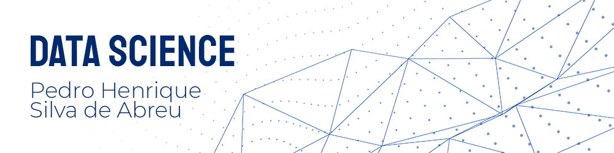

<!--     -->

  

*Cientista de Dados Júnior* na minha casa

*Graduando em Sistemas de Informação e Administração de Empresas*

Desde sempre fui apaixonado por matemática e inovação, até comecei uma graduação em *Licenciatura em Matemática*, mas a parte da inovação ficou faltando. Decidi trocar de gradução e fui me aventurar pelos caminhos da Administração de Empresas (ouvindo o conselho dos meus pais) e para não perder tempo ingressei em Sistemas de Informação. 
Cada vez mais ouvia comentários sobre dados e sua importância e passei a buscar sobre o assunto. Namorei essa área por uns 2 anos e em janeiro de 2021 criei coragem pra mergulhar nesse mar de dados que todos falam e todos os dias geramos mais e mais dados com nossos gadgets.
Por estar em duas graduações simultâneamente não sobra muito tempo pra devorar muito conteúdo de Ciência de Dados, então vou estar publicando com mais frequência nos feriados e férias acadêmicas.

**Links:**

* [LinkedIn](https://www.linkedin.com/in/pedro-henrique-silva-de-abreu/)
* [Medium](https://medium.com/@phsilvadeabreu)

## Projetos:
Aqui estão meus projetos em Data Science:

* **Ligações para o 911 no condado de Montgomery:** https://bit.ly/3pI3VTJ
* **Previsão de preços de imóveis com Machine Learning:** https://bit.ly/3q3nohI

<!-- * **Como usar o Histograma para Data Science:** https://bit.ly/2L2cMwy
* **Como Implementar Regressão Linear com Python:** https://bit.ly/2Li5pzY
* **Data Science: Investigando o naufrágio do Titanic:** https://bit.ly/2Ubr5SH
* **Como Tratar Dados Ausentes com Pandas:** https://bit.ly/31KWSMN
* **XGBoost: aprenda este algoritmo de Machine Learning em Python:** https://bit.ly/2UbRhws
* **Como criar uma Wordcloud em Python:** https://bit.ly/2OxsphM
* **Como lidar com dados desbalanceados:** https://bit.ly/2ZlaNsV -->

---

